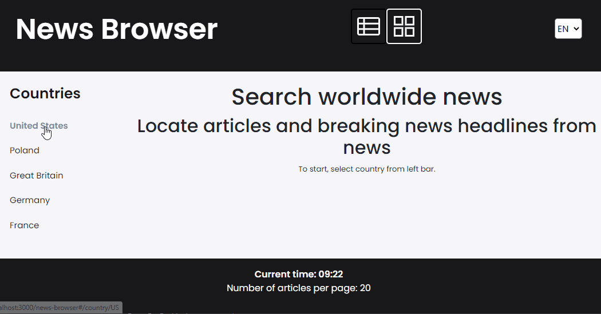

# News Browser

### Demo
https://q270311.github.io/news-browser/
### Description 
> Here, you can easily search and browse for worldwide news. 

On the left side of the window you can select the country from which you want to read news. The list of countries will be expanded regularly. 
The news is displayed in the main part of the window in the form of a list or grid, which can be changed using the buttons in the header of the page. 
By default, news items are sorted from newest to oldest by the date they were added to the database. 
By clicking on each news item, you can see details, including a direct link to the article. 
It is also possible to change the language of the application to Polish or English. 
At the bottom of the page there is the current time and the number of news on the page.
### Contributors
> The project was created by Michał Bałdyga

### Tech stack

> More details about tech:
 - React.js 
   - hooks: useState, useEffect, useRef, custom hooks
   - styled components
   - router v6
 - Redux | Redux Saga | Redux Toolkit
 - ES6+ features
 - JS axios async/await
 - JS Generator
 - localStorage
 - BEM convention
- Layout: flex | grid

### Getting Started with Create React App

This project was bootstrapped with [Create React App](https://github.com/facebook/create-react-app).

### Available Scripts

In the project directory, you can run:

### `npm start`

Runs the app in the development mode.\
Open [http://localhost:3000](http://localhost:3000) to view it in your browser.

The page will reload when you make changes.\
You may also see any lint errors in the console.

### `npm test`

Launches the test runner in the interactive watch mode.\
See the section about [running tests](https://facebook.github.io/create-react-app/docs/running-tests) for more information.

### `npm run build`

Builds the app for production to the `build` folder.\
It correctly bundles React in production mode and optimizes the build for the best performance.

The build is minified and the filenames include the hashes.\
Your app is ready to be deployed!

See the section about [deployment](https://facebook.github.io/create-react-app/docs/deployment) for more information.

### `npm run eject`

**Note: this is a one-way operation. Once you `eject`, you can't go back!**

If you aren't satisfied with the build tool and configuration choices, you can `eject` at any time. This command will remove the single build dependency from your project.

Instead, it will copy all the configuration files and the transitive dependencies (webpack, Babel, ESLint, etc) right into your project so you have full control over them. All of the commands except `eject` will still work, but they will point to the copied scripts so you can tweak them. At this point you're on your own.

You don't have to ever use `eject`. The curated feature set is suitable for small and middle deployments, and you shouldn't feel obligated to use this feature. However we understand that this tool wouldn't be useful if you couldn't customize it when you are ready for it.
